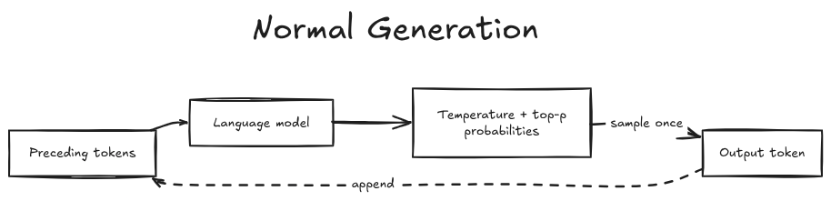
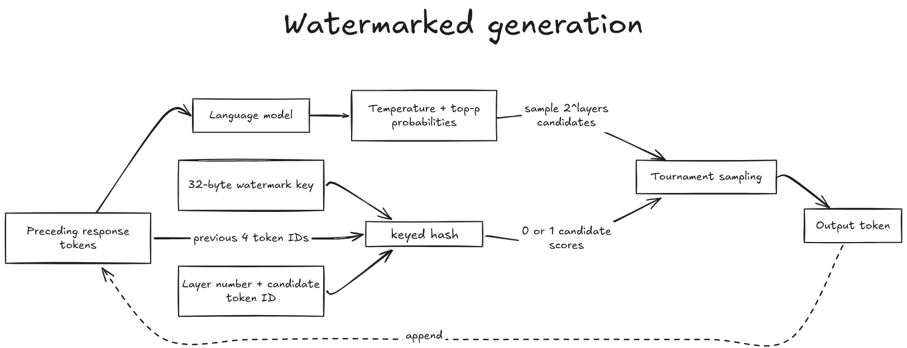
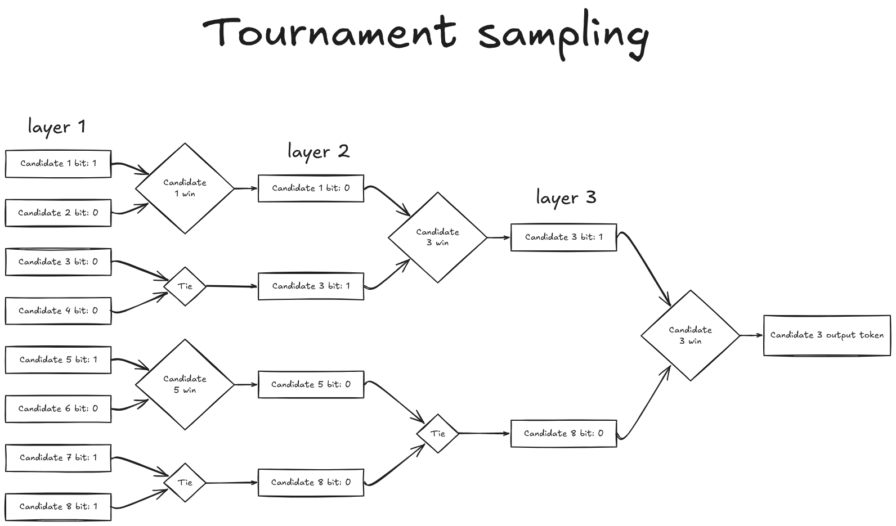
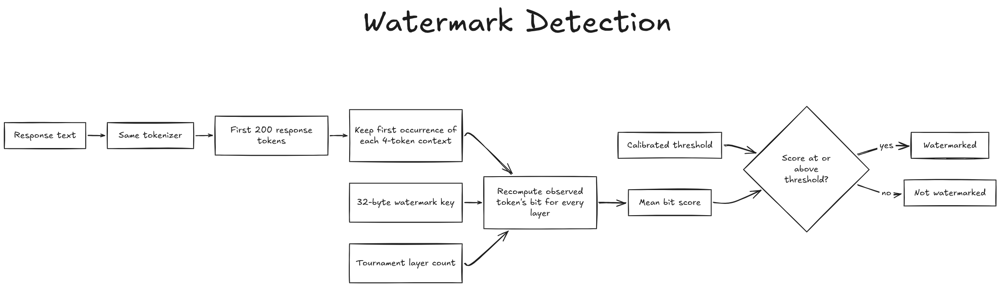

<h1 align="center">llm-watermark</h1>

<p align="center">
A minimal, educational implementation of SynthID-Text-style watermarking for language models
</p>

---

## Motivation

Recently, Anthropic [announced](https://www.anthropic.com/news/claude-text-watermark) that future Claude models will use text watermarking. I was curious about what that meant. Would model responses contain visible markers, strange phrases, or something like an ad saying, “By the way, buy our Max plan”?

It turns out that the watermark is not a visible message at all. It is a subtle statistical pattern introduced while the model chooses its tokens. The response should still read normally, but someone with the secret watermark key can examine enough of its tokens and look for that pattern.

Anthropic has not published Claude’s exact production implementation, detector, or key. Its article points to Google DeepMind’s [SynthID-Text](https://www.nature.com/articles/s41586-024-08025-4) approach, so I built this project to understand the public algorithm at a lower level.

> **Note:** This is an educational implementation, not a replica of Claude’s private watermarking system or Google’s production SynthID infrastructure. It implements the central published idea - keyed Tournament sampling, mean-bit detection, and empirical threshold calibration in a deliberately small codebase. Some components are simplified or implemented differently from the original SynthID-Text paper, so the results and implementation details should not be treated as an exact reproduction of the published system. These differences are identified where relevant below.

## What This Repo Is About

In this repository, I have tried to understand the complete workflow behind watermarking LLM responses and how each part works. This includes:

- how a model response is generated with a watermark.
- how to detect whether a model response contains that watermark.
- how to test how well the watermarking and detection process works.

The watermark changes only the sampling stage. It does not retrain the model, alter its weights, insert fixed phrases, or add hidden Unicode characters.

## The Core Idea

Normal stochastic generation samples one token from the model’s next-token distribution:

```text
context → model probabilities → sample one token
```

Watermarked generation samples several valid candidates from that same distribution and lets them compete in a secret, context-dependent tournament:

```text
context → model probabilities → sample candidates
        → keyed tournament → choose one winner
```

Every candidate still comes from the model’s normal distribution. The tournament only introduces a small preference for candidates that score well under a secret keyed function. One token reveals almost nothing, but the preference becomes measurable across a longer response.

### Normal generation



### Watermarked generation



The same keyed BLAKE2b calculation is used during generation and detection. Generation uses it to influence which candidate wins; detection uses it to check whether the observed tokens won unusually often under those keyed scores.

## Watermark Generation

### 1. Produce the next-token distribution

**In the paper:** The language model reads the preceding text and assigns a probability to every possible next token.

**In this implementation:** The Hugging Face model produces next-token logits. We apply the configured temperature and top-p filtering, then convert the filtered logits into probabilities.

### 2. Build a context-dependent watermark value

**In the paper:** At each generation step, a sliding-window seed generator hashes the secret key together with the previous four tokens to produce a pseudorandom seed, called `r_t`. The same context and key always reproduce the same `r_t`, which allows the detector to reconstruct it later. The paper then passes `r_t` to a separate pseudorandom watermark function for each tournament layer, called `g_1`, `g_2`, and so on. Each `g` function takes `r_t` and a candidate token and assigns that candidate a score for its layer. In the paper’s binary example, that score is either `0` or `1`.

**In this implementation:** For simplicity, instead of first generating a pseudorandom seed from the previous response tokens and then passing that seed to a separate layer-specific `g` function, we perform one keyed BLAKE2b calculation directly. For every candidate token at every tournament layer, we hash a payload containing the four previous response-token IDs, the layer number, and the candidate token ID, using the 32-byte watermark key as BLAKE2b’s secret key. The lowest bit of the digest becomes the candidate’s binary score, `0` or `1`. This single operation therefore replaces the combined role of the paper’s seed generator and `g` function; it is not an exact implementation of the paper’s internal pseudorandom functions. It preserves the properties needed here: the score varies with the response context, each layer has a distinct scoring function, and different candidate tokens can receive different scores. Because the calculation is deterministic, the detector can later reproduce the same bit from the generated text and key.

### 3. Sample the tournament candidates

**In the paper:** An `m`-layer binary tournament starts with `2^m` candidates sampled from the language-model distribution. Sampling uses replacement, so the same token may appear more than once.

**In this implementation:** We sample exactly `2^layers` candidates with `torch.multinomial(..., replacement=True)`. Four layers use 16 candidates, eight layers use 256, and twelve layers use 4,096.

### 4. Run the tournament

**In the paper:** Candidates compete in pairs. The candidate with the higher watermark value survives; ties are broken randomly. Winners are randomly regrouped and evaluated by the next watermark function until one candidate remains.

**In this implementation:** Every match has two competitors. We calculate both keyed bits, keep the higher-scoring candidate, and use a random bit to resolve ties. Later rounds randomly permute the remaining candidates before pairing them again.

For a four-layer run:

```text
16 candidates → 8 winners → 4 winners → 2 winners → 1 output token
```

The following three-layer example shows the tournament structure with generic candidate names. The displayed bits are only illustrative:



### 5. Append the winner and repeat

**In the paper:** The final tournament winner becomes the next token. It is appended to the context, and generation continues until an end token or maximum length is reached.

**In this implementation:** The winner is appended to the response and passed back to the model. We reuse the model’s attention cache instead of recomputing the complete sequence at every step. Generation stops at the tokenizer’s end token or `max_new_tokens`.

### 6. Mask repeated contexts

**In the paper:** Repeated-context masking is used for a stronger sequence-level non-distortion property. Reusing a context would otherwise reuse the same watermark decision.

**In this implementation:** If the same four-token response context appears again, its later occurrence is sampled normally rather than watermarked. Detection skips those repeated contexts as well.

The first four response tokens are also sampled normally because a complete four-token response context does not exist yet. Prompt tokens are not used as watermark context in this implementation.

## Watermark Detection

Detection does not need the language model. It needs only:

- the response text;
- the same tokenizer;
- the secret key;
- the number of tournament layers;
- the calibrated token-length and threshold configuration.



The detector works as follows:

1. **Tokenize the response.** No prompt or special tokens are added.
2. **Use a fixed prefix.** The default calibration requires the first 200 response tokens. Shorter responses are marked insufficient rather than classified.
3. **Reconstruct each context.** Starting after the first four tokens, take the preceding four-token window.
4. **Skip repeated contexts.** Only the first occurrence contributes evidence, matching generation.
5. **Recompute the keyed bits.** For the observed token, calculate one bit for every tournament layer.
6. **Average the evidence.** The raw score is the number of `1` bits divided by the total number of scored bits.
7. **Apply the calibrated threshold.** Scores at or above the threshold are classified as watermarked.

Ordinary text has no relationship with the secret key, so its bits should behave roughly like random values. Tournament sampling favors higher-scoring candidates, so watermarked text should produce a higher average over enough tokens.

A raw score alone is not a reliable yes/no answer. Text length, tokenizer, model distribution, decoding settings, layer count, and key all affect the score distribution. That is why this repository requires calibration instead of shipping a guessed threshold.

## Calibration and Evaluation

The experiment keeps threshold fitting separate from final evaluation so that the test set does not influence the decision rule.

### 1. Generate the development data

Each development prompt produces one ordinary, unwatermarked response. These responses are negative controls: they show how high the keyed score can become by chance.

### 2. Generate the held-out test data

Each test prompt produces a pair:

- one ordinary response;
- one watermarked response.

This gives held-out negative and positive examples for measuring the detector.

### 3. Score a fixed token prefix

Calibration tokenizes each development response and scores exactly the configured prefix, which is 200 tokens in the experiments below. Responses shorter than that prefix are excluded as insufficient.

Using a fixed prefix makes scores comparable. Otherwise, longer responses would contain more evidence than shorter responses.

### 4. Fit the threshold

Only ordinary development responses are used. Their scores are sorted, and the smallest observed threshold satisfying the requested false-positive-rate budget is selected. The experiments use a target development FPR of 1%.

The saved calibration artifact records the threshold together with the model, tokenizer, key fingerprint, layer count, required token count, and observed development FPR. Detection rejects a mismatched key rather than silently applying incompatible calibration.

### 5. Freeze and evaluate

The fitted threshold is applied unchanged to the held-out test pairs. Evaluation reports:

- **FPR:** the fraction of sufficient ordinary responses incorrectly classified as watermarked;
- **TPR:** the fraction of sufficient watermarked responses correctly detected;
- **insufficient rows:** responses that did not reach the required 200-token prefix.

## Experiments

I ran a layer-count comparison on ELI5 responses generated by LFM2.5-2.6B.

### Generation parameters

```text
model:              LiquidAI/LFM2.5-2.6B
dataset:            sentence-transformers/eli5
dataset config:     pair
dataset split:      train
development count:  4000 prompts
test count:         1000 prompts
max new tokens:     512
temperature:        0.7
top-p:              0.8
batch size:         64
device map:         auto
seed:               2026
key path:           keys/watermark.key
required tokens:    200
target FPR:         0.01
```

Each development prompt generated one ordinary response. Each test prompt generated one ordinary and one watermarked response, giving 2,000 test rows per run before insufficient responses were excluded from FPR and TPR.

### Results

| Tournament layers | Initial candidates | Threshold | Test FPR | Test TPR | Insufficient rows |
| ----------------: | -----------------: | --------: | -------: | -------: | ----------------: |
|                 4 |                 16 |    0.5438 |     0.5% |   34.33% |                 1 |
|                 8 |                256 |    0.5324 |     0.8% |   42.38% |                 2 |
|                12 |              4,096 |    0.5265 |     0.5% |   48.45% |                 1 |

In these runs, increasing the layer count improved held-out detection at roughly the same false-positive level. The cost rises quickly, however, because a binary `m`-layer tournament samples `2^m` candidates and evaluates a larger tournament for every generated token.
The generated ordinary and watermarked responses are available in the [Hugging Face dataset](https://huggingface.co/datasets/saad1926q/llm-watermark).


## Running the Project

This project requires Python 3.13 or newer and uses [uv](https://docs.astral.sh/uv/).

Generate a new 256-bit watermark key:

```bash
uv run python -m scripts.generate_key
```

Generate ordinary development responses and paired ordinary/watermarked test responses:

```bash
uv run python -m scripts.generate_data \
    --model LiquidAI/LFM2.5-2.6B \
    --dataset sentence-transformers/eli5 \
    --dataset-config pair \
    --dataset-split train \
    --development-count 4000 \
    --test-count 1000 \
    --max-new-tokens 512 \
    --temperature 0.7 \
    --top-p 0.8 \
    --batch-size 64 \
    --layers 4 \
    --seed 2026 \
    --device-map auto \
    --output-dir outputs/eli5-lfm2.5-2.6b-layers-4
```

Fit a threshold using only the ordinary development responses:

```bash
uv run python -m scripts.fit_threshold \
    --development outputs/eli5-lfm2.5-2.6b-layers-4/development.jsonl \
    --output outputs/eli5-lfm2.5-2.6b-layers-4/calibration.json \
    --required-tokens 200 \
    --target-fpr 0.01 \
    --layers 4
```

Evaluate the frozen threshold on the held-out test pairs:

```bash
uv run python -m scripts.evaluate \
    --test outputs/eli5-lfm2.5-2.6b-layers-4/test.jsonl \
    --calibration outputs/eli5-lfm2.5-2.6b-layers-4/calibration.json \
    --predictions-output outputs/eli5-lfm2.5-2.6b-layers-4/predictions.jsonl \
    --metrics-output outputs/eli5-lfm2.5-2.6b-layers-4/metrics.json
```

## References

- [Scalable watermarking for identifying large language model outputs](https://www.nature.com/articles/s41586-024-08025-4)
- [How Claude’s text watermark works](https://www.anthropic.com/news/claude-text-watermark)
